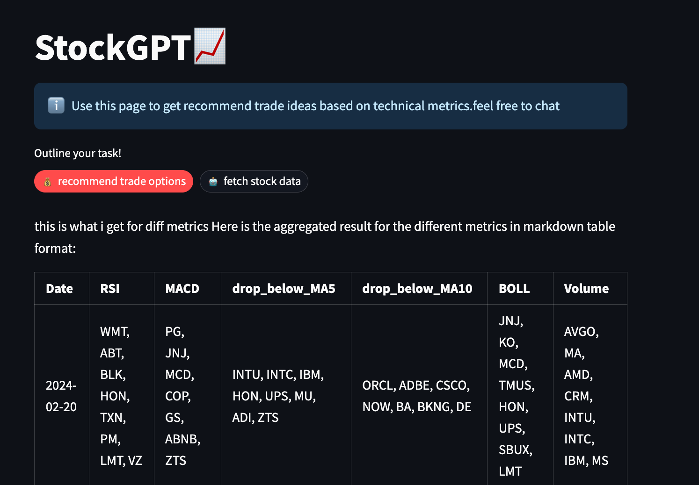

# StockGPT

StockGPT is a tool that utilizes the OpenAI API to recommend trade options based on various technical indicators in the stock market.

## Table of Contents
- [StockGPT](#stockgpt)
  - [Table of Contents](#table-of-contents)
  - [Installation](#installation)
  - [Usage](#usage)
  - [License](#license)

## Installation
1. git clone this project: `git clone https://github.com/spotify2junkie/stockGPT`
2. fill in openai API key in `.env` file: `OPENAI_API_KEY=your_api_key_here`
3. install dependencies: `poetry install`
4. activate poetry environment `poetry shell`, `set -a`, `source .env` , run the app through `streamlit run 1_home.py`

## Usage

StockGPT currently provides two commands:

- `🤖️fetch stock data`: Fetches the top 100 symbols according to market cap in the US stock market.
- `💰recommend trade options`: Recommends stocks based on technical indicators such as RSI, MACD, MA5, MA10, and volume change.

## License

This project is licensed under the [MIT License](LICENSE).
